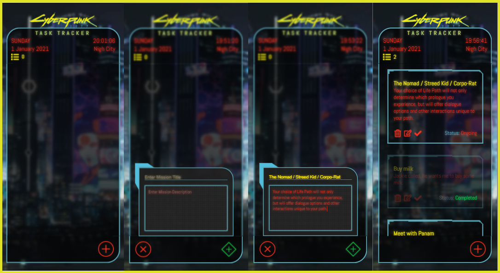

<h1>ToDo inspired by Cyberpunk 2077</h1>
<h2>Project Overview</h2>

 This project represents a ToDo list which allows users to add, edit or delete a note they have created. In addition to that, the information about the time and date is displayed as well as how many uncompleted tasks there are.

 

<h2>Design</h2>

The colors are inspired by the offical Cyberpunk 2077 promotional material colors as well as the colors and their "glow" frome the ingame HUD.

<ul>
    <li>Red (#FF3422)</li>
    <li>Cyan (#5FACBC)</li>
    <li>Yellow(#FCEE0A)</li>
    <li>Green(#00CA45)</li>
</ul>

The Figma design can be found <a href="https://www.figma.com/file/97dagT1qlyv2SExyzfS5ZI/Cyberpunk-2077-To-Do?node-id=0%3A1">here</a>.

<h2>Technologies</h2>

For this project the following tecnologies were used:

<ul>
    <li>
HTML - Used to create the markup of the page.

    </li>
        <li>
SASS/CSS - Sass was used in order to streamline and simplify the styling of the page.

    </li>
        </li>
        <li>
ReactJS - This framework was useful to more easily create sections and components of the website.

    </li>

</ul>
